# 🏢 BSIS Attendance System

A comprehensive, production-ready attendance management system featuring a modern Boostrap frontend and Laravel backend integration. Built with premium design aesthetics and enterprise-grade functionality.


## ✨ Features

### 🎨 **Premium Design System**
- **Apple-level Design Aesthetics** - Meticulous attention to detail with sophisticated visual presentation
- **Dark Theme Interface** - Professional dark mode with gradient backgrounds and glass-morphism effects
- **Responsive Design** - Seamless experience across desktop, tablet, and mobile devices
- **Micro-interactions** - Smooth animations, hover states, and visual feedback
- **Consistent Branding** - Unified design language throughout the entire system

### 🚀 **Frontend Features (Boostrap + Tailwind)**
- **Modern Attendance Form** - Intuitive form with real-time validation
- **Smart Form Management** - Auto-reset, loading states, and error handling
- **Department Selection** - Pre-configured department options
- **Attendance Type Toggle** - Clock-in/Clock-out selection with visual indicators
- **Location Tracking** - Required location field for attendance records
- **Notes Support** - Optional additional information field
- **Success Feedback** - Beautiful success screen with auto-redirect

### 🏗️ **Backend Integration (Laravel)**
- **Premium Authentication** - Beautiful login/register pages with enhanced UX
- **Dashboard System** - Comprehensive attendance management interface
- **Data Import/Export** - Excel file import with drag & drop functionality
- **Penalty Management** - Automated fine calculation and reporting
- **Employee Management** - Complete employee data handling
- **Responsive Tables** - Advanced data display with filtering and pagination

### 📊 **Dashboard Components**
- **Daily Attendance View** - Real-time attendance monitoring
- **Penalty Reports** - Monthly fine calculations and summaries
- **Excel Import System** - Batch data import with validation
- **Advanced Filtering** - Date, employee, and department filters
- **Status Indicators** - Visual attendance status with color coding
- **Statistics Cards** - Key metrics and summary information

## 🛠️ Technology Stack

### Frontend
- **Bootstrap 5.3.3** – Framework CSS responsif modern untuk desain elegan dan mobile-first
- **Tailwind CSS 3.4.1** - Utility-first CSS framework for rapid styling
- **Bootstrap Icons** - Comprehensive icon library
- **Inter Font** - Professional typography system


### Backend Integration
- **Laravel 10.10** - Designed for seamless Laravel API integration
- **Vite 5.4.2** - Lightning-fast build tool and development server


## 🚀 Quick Start

### Frontend Setup

1. **Install Dependencies**
   ```bash
   npm install
   ```

2. **Configure Environment**
   ```bash
   cp .env.example .env
   ```
   
   Update your `.env` file:
   ```env
   APP_URL=http://localhost
   VITE_APP_URL=http://localhost
   ```

3. **Start Development Server**
   ```bash
   npm run dev
   ```

4. **Build for Production**
   ```bash
   npm run build
   ```

### Laravel Backend Setup

1. **Web Routes** - Add to `routes/web.php`:
   ```php
   Route::post('/attendance', [AttendanceController::class, 'store']);
   ```

2. **Controller Implementation**:
   ```php
   public function store(Request $request)
   {
       $validated = $request->validate([
           'full_name' => 'required|string|max:255',
           'employee_id' => 'required|string|max:50',
           'department' => 'required|string',
           'attendance_type' => 'required|in:clock-in,clock-out',
           'date' => 'required|date',
           'time' => 'required',
           'location' => 'required|string|max:255',
           'notes' => 'nullable|string|max:1000',
       ]);

       Attendance::create($validated);

       return response()->json([
           'success' => true,
           'message' => 'Attendance recorded successfully!'
       ]);
   }
   ```

3. **Database Migration**:
   ```php
   Schema::create('attendances', function (Blueprint $table) {
       $table->id();
       $table->string('full_name');
       $table->string('employee_id');
       $table->string('department');
       $table->enum('attendance_type', ['clock-in', 'clock-out']);
       $table->date('date');
       $table->time('time');
       $table->string('location');
       $table->text('notes')->nullable();
       $table->timestamps();
   });
   ```

## 📁 Project Structure

```
resources/views/
├── auth/                   # Authentication pages
│   ├── login.blade.php     # Premium login interface
│   └── register.blade.php  # Enhanced registration form
└── absensi/               # Attendance management
    ├── index.blade.php     # Daily attendance view
    ├── recap.blade.php     # Penalty reports
    └── import.blade.php    # Excel import system
```

## 🎨 Design Features

### **Visual Excellence**
- **Gradient Backgrounds** - Sophisticated color transitions
- **Glass-morphism Effects** - Modern translucent design elements
- **Smooth Animations** - 60fps transitions and micro-interactions
- **Professional Typography** - Inter font family for optimal readability
- **Consistent Spacing** - 8px grid system for perfect alignment

### **User Experience**
- **Intuitive Navigation** - Clear information hierarchy
- **Visual Feedback** - Immediate response to user actions
- **Error Handling** - Graceful error states with helpful messages
- **Loading States** - Professional loading indicators
- **Success Confirmations** - Satisfying completion feedback

### **Responsive Design**
- **Mobile-First Approach** - Optimized for all screen sizes
- **Touch-Friendly Interface** - Appropriate touch targets
- **Flexible Layouts** - Adaptive grid systems
- **Consistent Experience** - Unified design across devices

## 🔧 Configuration

### **Environment Variables**
- `VITE_APP_URL` - Base URL For Laravel API & Web (digunakan oleh frontend JS)
- `APP_URL=http://localhost` - URL Core Laravel (User For backend)
### **Supported Departments**
- Engineering
- Marketing
- Sales
- Human Resources
- Finance
- Operations

### **Attendance Types**
- Clock In - Start of work day
- Clock Out - End of work day

## 🚀 Deployment

### **Frontend Deployment**
- **Netlify** - Drag and drop the `dist` folder
- **Vercel** - Connect your Git repository
- **GitHub Pages** - Use GitHub Actions for deployment

### **Backend Requirements**
- Laravel 10+ with Sanctum for API authentication
- MySQL/PostgreSQL database
- CORS configuration for frontend domain
- File upload support for Excel imports

## 🔒 Security Features

### **Frontend Security**
- **CSRF Protection** - Laravel Sanctum integration
- **Input Validation** - Client-side and server-side validation
- **XSS Prevention** - Proper data sanitization
- **Type Safety** - TypeScript for runtime error prevention

### **Backend Security**
- **Authentication Required** - Protected admin routes
- **File Upload Validation** - Secure file handling
- **SQL Injection Prevention** - Eloquent ORM protection
- **Rate Limiting** - API request throttling

## 📊 Features Overview

### **Attendance Management**
- ✅ Real-time attendance recording
- ✅ Employee identification system
- ✅ Department-based organization
- ✅ Location tracking
- ✅ Notes and comments support

### **Administrative Features**
- ✅ Daily attendance monitoring
- ✅ Monthly penalty reports
- ✅ Excel data import/export
- ✅ Advanced filtering options
- ✅ Statistical summaries

### **User Interface**
- ✅ Premium dark theme design
- ✅ Responsive mobile interface
- ✅ Intuitive form validation
- ✅ Success/error feedback
- ✅ Loading state management

## 🤝 Contributing

1. Fork the repository: [Gezod/salary_bsis](https://github.com/Gezod/salary_bsis)
2. Create a feature branch (`git checkout -b feature/amazing-feature`)
3. Commit your changes (`git commit -m 'Add amazing feature'`)
4. Push to the branch (`git push origin feature/amazing-feature`)
5. Open a Pull Request to the main branch on Gezod/salary_bsis

## 📄 License

This project is open source and available under the [MIT License](LICENSE).

## 🙏 Acknowledgments

- **Bank Sampah Induk Surabaya** - Logo and branding
- **Inter Font Family** - Professional typography
- **Boostrap Icons** - Beautiful icon system
- **Tailwind CSS** - Utility-first CSS framework
- **Boostrap CSS** - Amazing ecosystem and tools

---

<div align="center">
  <p><strong>Built with ❤️ for modern attendance management</strong></p>
  <p>© 2025 BSIS Attendance System. All rights reserved.</p>
</div>

### 🗓️ Daily Attendance
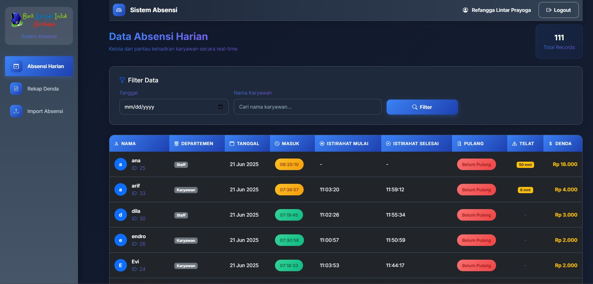

### 📥 Import Excel
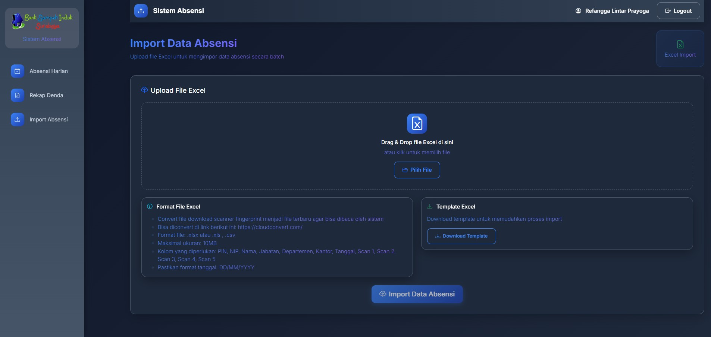

### 📑 Rekap Denda
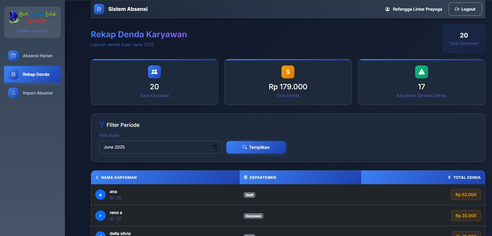

### 📑 Absensi Manual
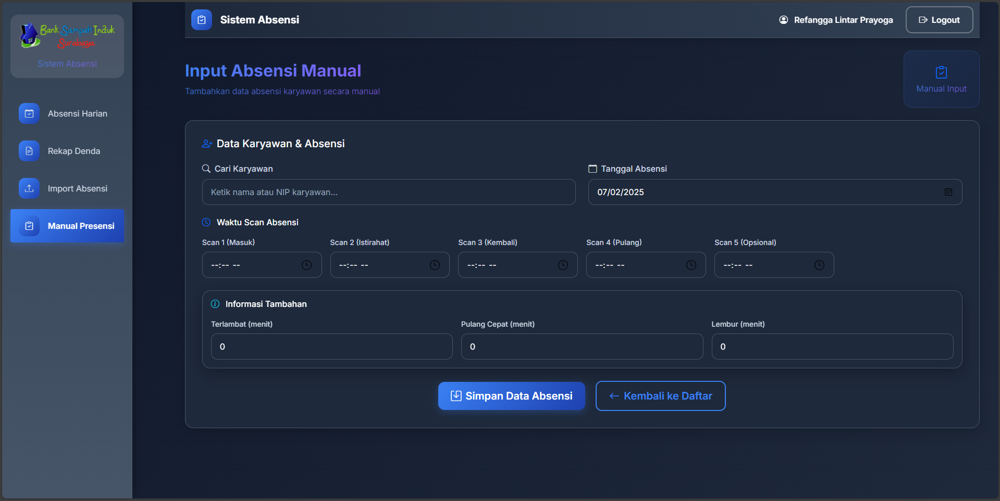

### 📑 Setting Denda Staff
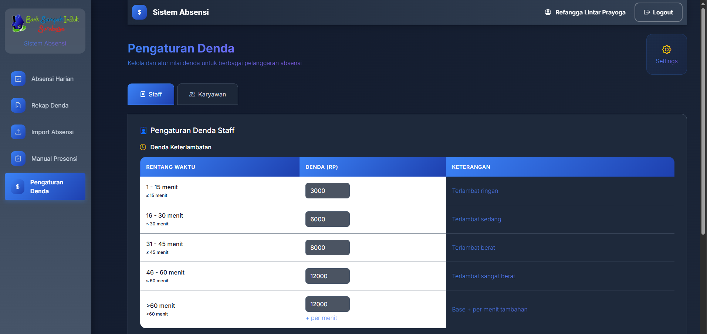

### 📑 Setting Denda Staff
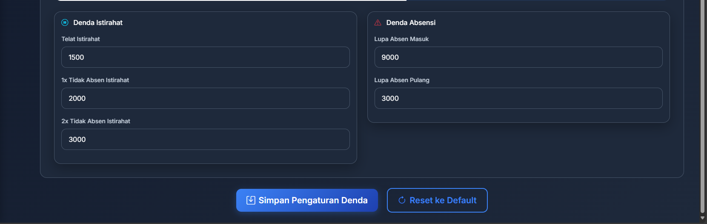

### 📑 Setting Denda Karyawan
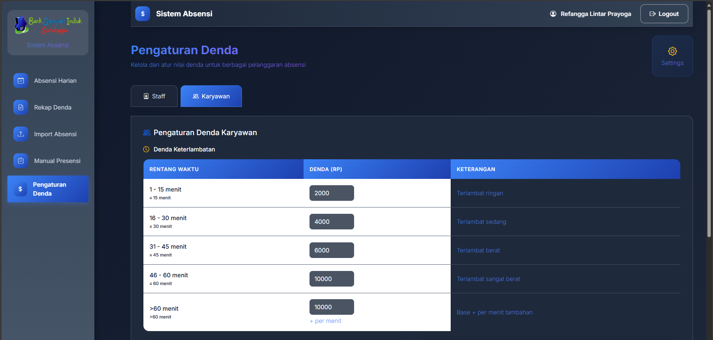

### 📑 Setting Denda Karyawan
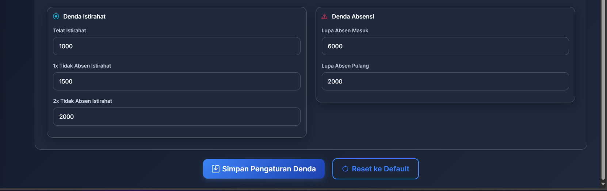

### 📑 Overview Lembur Staff & Karyawan
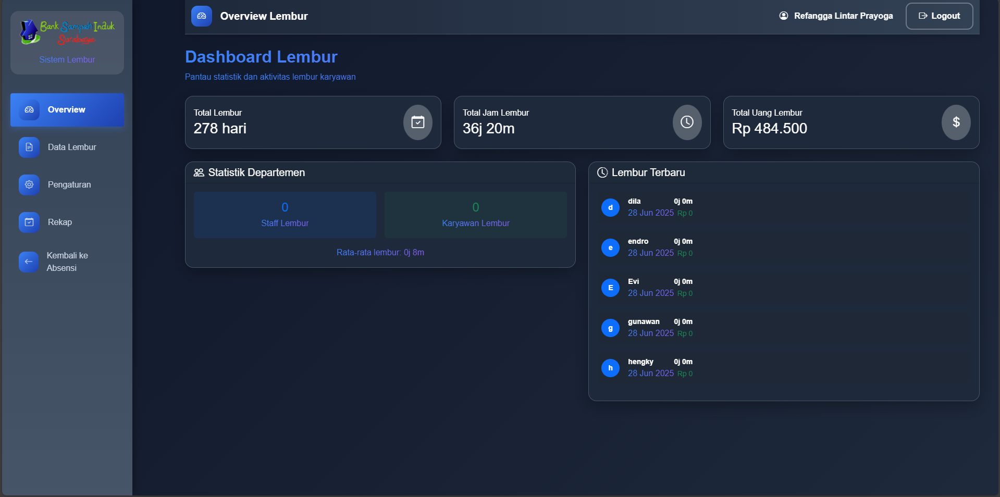

### 📑 Data Lembur Staff & Karyawan
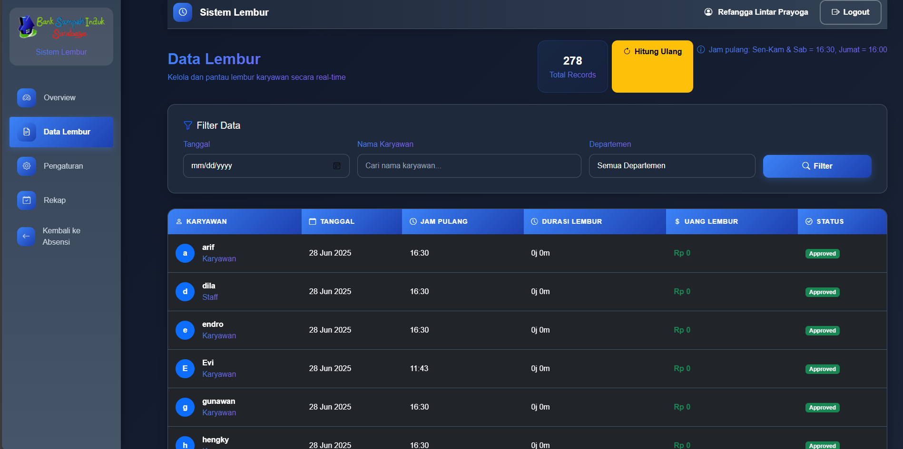

### 📑 Setting Lembur Staff & Karyawan
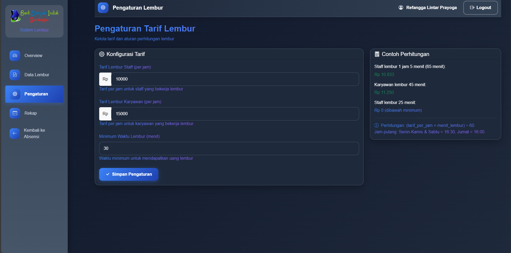

### 📑 Rekap Lembur Staff & Karyawan
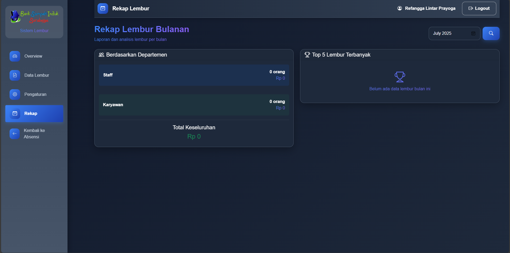

### 📑 Rekap Lembur Staff & Karyawan


### 📑 Data Payroll Staff & Karyawan
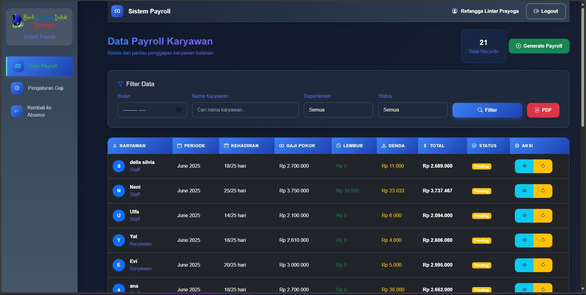

### 📑 Setting Data Payroll Staff & Karyawan
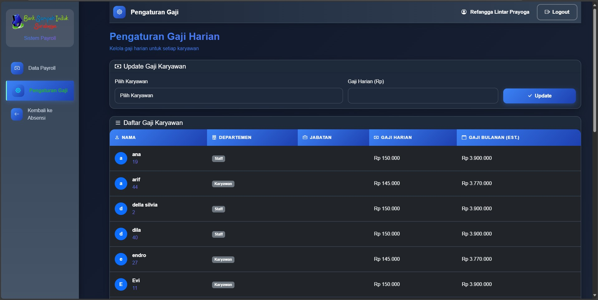

### 📑 Data Payroll Based On ID with Name
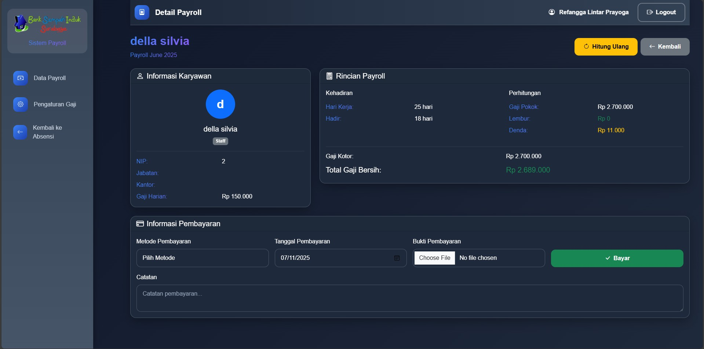

🔧 PHP Extension Activation Guide (XAMPP)
Required Extensions
zip (for file compression)

gd (for image processing)

A. Configuration Steps
1. Activate ZIP Extension
Open php.ini at: C:\xampp\php\php.ini

1. Find this line (around line 930):
;extension=zip

1. Remove the semicolon (;) to make it:
extension=zip

1. Save the file
   
2. Restart Apache via XAMPP Control Panel

B. Configuration Steps
1. Activate Image Extension
Open php.ini at: C:\xampp\php\php.ini

2. Find this line (around line 927):
;extension=gd

3. Remove the semicolon (;) to make it:
extension=gd

4. Save the file
   
5. Restart Apache via XAMPP Control Panel


## 🗃️ Database Management

### Update Employee Departments

Run the following commands in `php artisan tinker` to update employee departments:

```php
// List of karyawan
$karyawan = [
    'evi', 'endro', 'mirah', 'suhantono', 'gunawan', 'reno a', 'arif', 
    'rahayu', 'hilmi', 'sujono', 'heri', 'nantha', 'Yat', 'inda', 'hengky'
];

$staff = [
    'della silvia', 'neni', 'ana', 'zana', 'dila', 'hasna', 'ulfa'
];

// Update karyawan
foreach ($karyawan as $nama) {
    $normalized = strtolower(trim($nama));
    \App\Models\Employee::whereRaw('LOWER(TRIM(nama)) = ?', [$normalized])
        ->update(['departemen' => 'Karyawan']);
}

// Update staff and track missing names
$missingStaff = [];
foreach ($staff as $nama) {
    $normalized = strtolower(trim($nama));
    $found = \App\Models\Employee::whereRaw('LOWER(TRIM(nama)) = ?', [$normalized])->first();

    if ($found) {
        $found->update(['departemen' => 'Staff']);
    } else {
        $missingStaff[] = $nama;
    }
}

// Output results
if (!empty($missingStaff)) {
    echo "Staff not found in database:\n";
    print_r($missingStaff);
} else {
    echo "All staff updated successfully!";
}


## 🗃️ Database Management
### Update Jabatan Employee (Contoh)
use App\Models\Employee;

// Jabatan untuk masing-masing orang
$jabatanData = [
    'della silvia' => 'Customer Service',
    'zana' => 'Manajer Dept. Pemasaran',
    'neni' => 'Manajer Dept. HRD & Keuangan',
    'ana' => 'Teller',

    // Bankeling
    'evi' => 'Bankeling',
    'endro' => 'Bankeling',
    'mirah' => 'Bankeling',
    'suhantono' => 'Bankeling',
    'gunawan' => 'Bankeling',
    'reno a' => 'Bankeling',
    'arif' => 'Bankeling',

    // Produksi
    'rahayu' => 'Produksi',
    'hilmi' => 'Produksi',
    'sujono' => 'Produksi',
    'heri' => 'Produksi',
    'nantha' => 'Produksi',
    'yat' => 'Produksi',
    'inda' => 'Produksi',
    'hengky' => 'Produksi',
];

$missing = [];

foreach ($jabatanData as $nama => $jabatan) {
    $normalized = strtolower(trim($nama));

    $employee = Employee::whereRaw('LOWER(TRIM(nama)) = ?', [$normalized])->first();

    if ($employee) {
        $employee->update(['jabatan' => $jabatan]);
    } else {
        $missing[] = $nama;
    }
}

// Output hasil
if (!empty($missing)) {
    echo "Nama berikut tidak ditemukan di database:\n";
    print_r($missing);
} else {
    echo "Semua jabatan berhasil diperbarui!\n";
}

